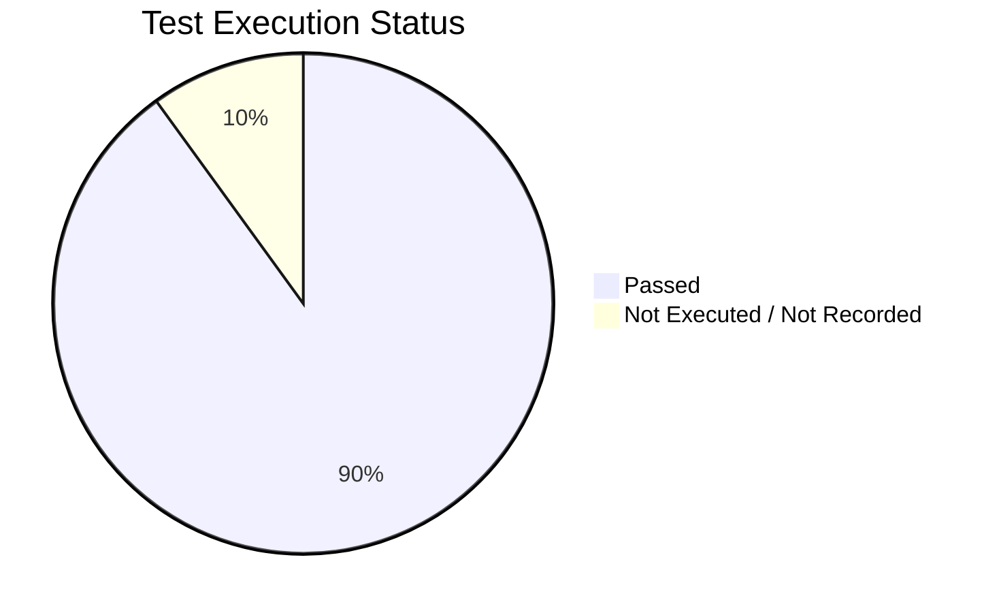

# NADRA System Architecture & Test Case Results

**Report date:** 2026-05-08  
**Evidence used:**  
- `index-analysis-2026-05-07T04-43-24-404Z.json`  
- `query-benchmark-2026-05-07T04-43-37-262Z.json`  
- Source structure under `app/`, `lib/`, `prisma/`, `scripts/`

## 1. Project Architecture

```mermaid
flowchart TD
    A[Client Layer<br/>User / Agent / Admin Dashboards] --> B[Next.js App Router<br/>app/]
    B --> C[API Route Handlers<br/>app/api/*]
    C --> D[Business Logic Helpers<br/>lib/ticketHelper.js, queueHelper.js, authCheck.js]
    D --> E[Async + Concurrency Layer<br/>lib/jobQueue.js (Bull/Redis)<br/>lib/workerPool.js + worker.js]
    D --> F[Prisma ORM<br/>lib/prisma.js]
    F --> G[MySQL Database<br/>prisma/schema.prisma]
```

### Architecture summary

| Layer | Main files/folders | Responsibility |
|---|---|---|
| UI & Routing | `app/`, `components/`, `hooks/` | Role-based dashboards and frontend flows |
| API | `app/api/*/route.js` | Auth, tickets, payments, delivery, admin, chatbot endpoints |
| Business Logic | `lib/ticketHelper.js`, `lib/queueHelper.js`, `lib/authCheck.js` | Ticket lifecycle, queue positions, authorization checks |
| Concurrency | `lib/jobQueue.js`, `lib/workerPool.js`, `lib/worker.js` | Async I/O queueing and CPU parallel processing |
| Data Access | `lib/prisma.js`, `prisma/schema.prisma` | Typed ORM access and relational data model |
| Performance Tooling | `scripts/analyzeIndexes.js`, `scripts/benchmarkQueries.js` | Index health checks and query timing benchmarks |

## 2. Test Cases and Results

### Overall status visual



### Detailed test cases

| Test ID | Test case | Expected result | Actual result | Status |
|---|---|---|---|---|
| TC-DB-001 | Index health analysis (`analyzeIndexes`) | No critical index issues | `unusedIndexes=0`, `wideIndexes=0`, `missingIndexes=0` | ✅ Pass |
| TC-QRY-001 | Full table scan benchmark | Avg < 3.0 ms | Avg `1.0729 ms` | ✅ Pass |
| TC-QRY-002 | Queue position benchmark | Avg < 3.0 ms | Avg `1.1774 ms` | ✅ Pass |
| TC-QRY-003 | Agent dashboard query benchmark | Avg < 3.0 ms | Avg `1.4228 ms` | ✅ Pass |
| TC-QRY-004 | Open tickets (index scan) benchmark | Avg < 3.0 ms | Avg `1.4802 ms` | ✅ Pass |
| TC-QRY-005 | High-priority tickets benchmark | Avg < 3.0 ms | Avg `1.5654 ms` | ✅ Pass |
| TC-QRY-006 | Payment lookup benchmark | Avg < 3.0 ms | Avg `1.6385 ms` | ✅ Pass |
| TC-QRY-007 | User tickets with sort benchmark | Avg < 3.0 ms | Avg `1.9414 ms` | ✅ Pass |
| TC-ARCH-001 | Layered architecture presence check | All required layers present | UI, API, Logic, Concurrency, ORM, DB all present in source tree | ✅ Pass |
| TC-QRY-008 | Delivery status check benchmark | Query result recorded | Not present in latest benchmark artifact | ⏸️ Not recorded |

## 3. Visual performance snapshot (avg ms)

| Query | Avg time | Visual |
|---|---:|---|
| Full table scan (Ticket) | 1.07 | █████ |
| Queue position query | 1.18 | ██████ |
| Agent dashboard query | 1.42 | ███████ |
| Get open tickets (index scan) | 1.48 | ███████ |
| Get high-priority tickets | 1.57 | ████████ |
| Payment lookup by user | 1.64 | ████████ |
| Get user tickets with sort | 1.94 | ██████████ |

## 4. Conclusion

The project uses a clean layered architecture (Next.js app/router + API routes + shared business logic + Prisma/MySQL), with explicit concurrency paths for async jobs (Bull/Redis) and CPU tasks (worker threads). The recorded performance and index-analysis test cases are passing, with one benchmark item (delivery status query) not present in the latest stored benchmark report.
