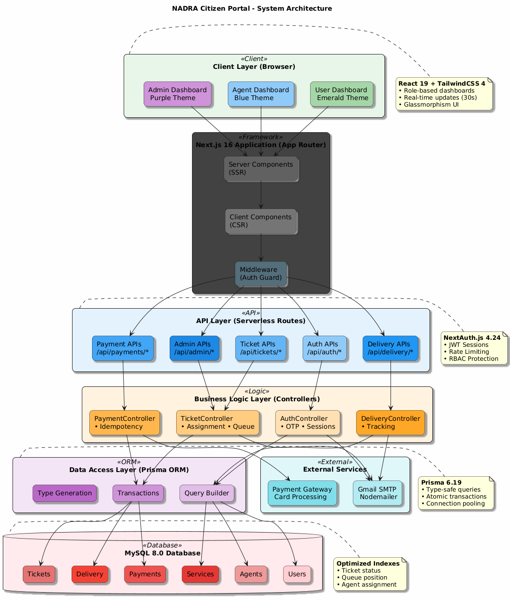

# NADRA Citizen Portal - Final Project Report

## Software Engineering Milestone Documentation

**Project:** NADRA Citizen Portal - Complete Service Management System  
**Developer:** Umer Khan  
**Date:** December 2025  
**Version:** 1.0.0

---

## Table of Contents

1. [Executive Summary](#1-executive-summary)
2. [System Overview](#2-system-overview)
3. [Technology Stack](#3-technology-stack)
4. [System Architecture](#4-system-architecture)
5. [UML Diagrams](#5-uml-diagrams)
   - [5.1 Use Case Diagram](#51-use-case-diagram)
   - [5.2 Class Diagram](#52-class-diagram)
   - [5.3 Activity Diagram](#53-activity-diagram)
   - [5.4 Sequence Diagram](#54-sequence-diagram)
   - [5.5 Collaboration Diagram](#55-collaboration-diagram)
6. [Database Design](#6-database-design)
7. [Security Features](#7-security-features)
8. [Key Features](#8-key-features)
9. [Conclusion](#9-conclusion)

---

## 1. Executive Summary

The **NADRA Citizen Portal** is a production-ready, full-stack service management platform designed to streamline citizen service delivery for Pakistan's National Database and Registration Authority. The system provides:

- **End-to-end ticket management** from creation to delivery
- **Multi-role dashboards** for Citizens, Agents, and Administrators
- **Intelligent queue management** with priority-based ordering
- **Integrated payment processing** (Online & Cash on Delivery)
- **Real-time delivery tracking** with email notifications
- **Enterprise-grade security** with OTP verification and role-based access

---

## 2. System Overview

### Project Highlights

| Feature | Description |
|---------|-------------|
| 🎫 **Ticket System** | Automated assignment, queue tracking, priority handling |
| 💳 **Payments** | Online card processing, COD, idempotency protection |
| 🚚 **Delivery** | 4-step tracking timeline, email notifications |
| 👥 **Multi-Role** | Citizen, Agent, Admin dashboards |
| 🔐 **Security** | OTP, JWT, rate limiting, RBAC |
| 📊 **Analytics** | Real-time stats, system logs, audit trail |

### User Roles

1. **Citizen (USER)** - Create tickets, upload documents, make payments, track delivery
2. **Agent (AGENT)** - Process tickets, update status, manage deliveries
3. **Admin (ADMIN)** - Full system control, user management, analytics

---

## 3. Technology Stack

### Frontend
- **Next.js 16.0.1** - React framework with App Router
- **React 19.2.0** - Latest concurrent features
- **TailwindCSS 4** - Utility-first styling
- **shadcn/ui** - Accessible component library

### Backend
- **Next.js API Routes** - Serverless endpoints
- **NextAuth.js 4.24** - Authentication solution
- **Prisma ORM 6.19** - Type-safe database access
- **MySQL 8.0** - Production database

### Infrastructure
- **Nodemailer** - Email notifications
- **bcryptjs** - Password hashing
- **TypeScript** - Type safety

---

## 4. System Architecture

The NADRA Citizen Portal follows a **layered architecture** pattern:



### Architecture Layers

| Layer | Technology | Responsibility |
|-------|------------|----------------|
| **Client** | React + TailwindCSS | User interface, dashboards |
| **Application** | Next.js 16 | SSR, routing, middleware |
| **API** | API Routes | RESTful endpoints |
| **Business Logic** | Controllers | Business rules, validation |
| **Data Access** | Prisma ORM | Database operations |
| **Database** | MySQL 8.0 | Data persistence |
| **External** | Gmail, Payment GW | Email, payments |

### Key Architecture Decisions

1. **Server-Side Rendering** - Better SEO and initial load performance
2. **Serverless API Routes** - Scalable backend functions
3. **Prisma Transactions** - Data consistency, race condition prevention
4. **Index Optimization** - Fast query performance

---

## 5. UML Diagrams

### 5.1 Use Case Diagram

**Purpose:** Shows system functionality from user perspective, identifying actors and their interactions with the system.


**Actors:**
- Citizen - Primary user creating service requests
- Agent - Staff processing tickets
- Admin - System administrator
- Email System - External notification service
- Payment Gateway - External payment processor

**Key Use Cases:**
- Register Account, Login, Verify OTP
- Create Service Ticket, Upload Documents
- Process Payment, Track Delivery
- Manage Users, Manage Agents

---

### 5.2 Class Diagram

**Purpose:** Shows the static structure of the system, including classes, attributes, methods, and relationships.


**Entity Classes:**
- User, Agent, Service, Ticket
- Payment, Delivery, TicketLog
- UploadedDocument, RequiredDocument

**Control Classes:**
- AuthController, TicketController
- PaymentController, DeliveryController
- AdminController

**Boundary Classes:**
- LoginForm, RegistrationForm
- UserDashboard, AgentDashboard, AdminDashboard
- TicketCreationForm, PaymentForm

---

### 5.3 Activity Diagram

**Purpose:** Models the workflow of the ticket creation and payment process, showing decision points and parallel activities.


**Process Flow:**
1. Citizen accesses portal and selects service
2. System validates documents and delivery info
3. Agent assignment algorithm finds available agent
4. Ticket, Payment, and Delivery records created
5. Payment processed (Online or COD)
6. Agent processes ticket and updates delivery
7. Delivery completed with email notifications

---

### 5.4 Sequence Diagram

**Purpose:** Shows time-ordered interactions between objects during the ticket creation use case.


**Key Interactions:**
- Citizen → TicketForm → TicketController
- TicketController → Database (Transaction)
- PaymentController → Payment Gateway
- Controllers → EmailService (Notifications)

**Transaction Boundaries:**
- Ticket creation is atomic
- Payment processing has idempotency protection
- Queue recalculation is synchronized

---

### 5.5 Collaboration Diagram

**Purpose:** Shows object relationships and message flow for the ticket creation scenario.


**Message Numbering:**
- 1: accessPage()
- 2: submitTicket()
- 2.1: createTicket()
- 2.2: findAvailableAgent()
- 3: processPayment()
- 4: checkQueue()

---

## 6. Database Design

### Entity Relationship Overview

```
User (1) ────< (M) Ticket ────> (1) Agent
                  │
    ┌─────────────┼─────────────┐
    │             │             │
    ▼             ▼             ▼
Payment       Delivery      TicketLog
```

### Key Tables

| Table | Purpose | Key Fields |
|-------|---------|------------|
| **User** | Citizen accounts | id, email, cnic, role |
| **Agent** | Staff accounts | id, username, maxTickets |
| **Ticket** | Service requests | status, priority, queuePosition |
| **Payment** | Financial records | amount, status, transactionId |
| **Delivery** | Shipping info | trackingNumber, status |
| **Service** | Available services | name, fee, priority |

### Indexes for Performance

```sql
CREATE INDEX idx_ticket_status ON Ticket(status);
CREATE INDEX idx_ticket_queue ON Ticket(queuePosition);
CREATE INDEX idx_ticket_agent ON Ticket(agentId, status);
CREATE INDEX idx_payment_status ON Payment(status);
CREATE INDEX idx_delivery_tracking ON Delivery(trackingNumber);
```

---

## 7. Security Features

### Authentication
- ✅ bcrypt password hashing (10 rounds)
- ✅ 6-digit OTP with 10-minute expiry
- ✅ JWT sessions with 30-day validity
- ✅ Rate limiting: 3 OTP requests / 15 minutes

### Authorization
- ✅ Role-based access control (USER, AGENT, ADMIN)
- ✅ Route protection via middleware
- ✅ API endpoint authorization

### Data Protection
- ✅ Input validation and sanitization
- ✅ SQL injection prevention (Prisma ORM)
- ✅ Payment idempotency protection
- ✅ Transaction-based operations

---

## 8. Key Features

### Smart Ticket Management
- Priority-based queue ordering (URGENT before NORMAL)
- Intelligent agent assignment (load balancing)
- Real-time queue position tracking (30s refresh)
- Automatic ticket reassignment on completion

### Payment Processing
- Online card payment with validation
- Cash on Delivery option
- Transaction ID generation
- Idempotency protection (no double charges)

### Delivery Tracking
- 4-step visual timeline
- Email notifications at each stage
- Agent assignment and tracking numbers
- Estimated and actual delivery timestamps

### Admin Dashboard
- System-wide statistics
- User and agent management
- Service configuration
- Audit logs and monitoring

---

## 9. Conclusion

The NADRA Citizen Portal successfully implements a comprehensive service management system with:

- **Clean Architecture** - Layered design with separation of concerns
- **Robust Security** - Multi-layer authentication and authorization
- **Optimized Performance** - Indexed queries and transaction management
- **User-Friendly Interface** - Role-specific dashboards with modern UI
- **Complete Documentation** - UML diagrams for all system aspects

The system is **production-ready** and provides a solid foundation for citizen service delivery.

---

## Appendix: File Structure

```
/uml/
├── use_case_diagram.puml        # Use case diagram source
├── use_case_diagram.png         # Rendered use case diagram
├── class_diagram.puml           # Class diagram source
├── class_diagram.png            # Rendered class diagram
├── activity_diagram.puml        # Activity diagram source
├── activity_diagram.png         # Rendered activity diagram
├── sequence_diagram.puml        # Sequence diagram source
├── sequence_diagram.png         # Rendered sequence diagram
├── collaboration_diagram.puml   # Collaboration diagram source
├── collaboration_diagram.png    # Rendered collaboration diagram
├── system_architecture_diagram.puml  # Architecture diagram source
├── system_architecture_diagram.png   # Rendered architecture diagram
├── explanations.md              # Diagram explanations
└── final_report.md              # This report
```

---

**End of Report**

*Generated for NADRA Citizen Portal - Software Engineering Milestone*
